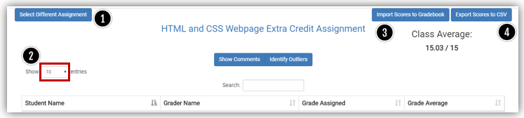
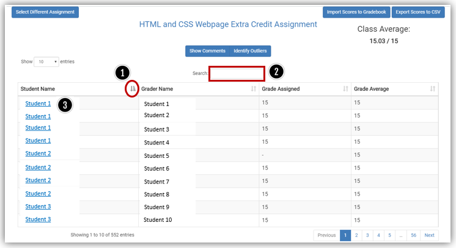
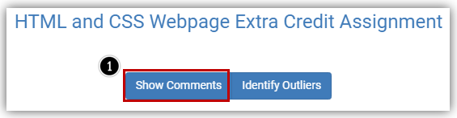
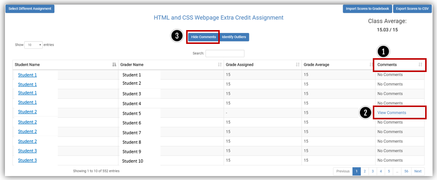
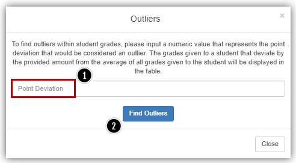
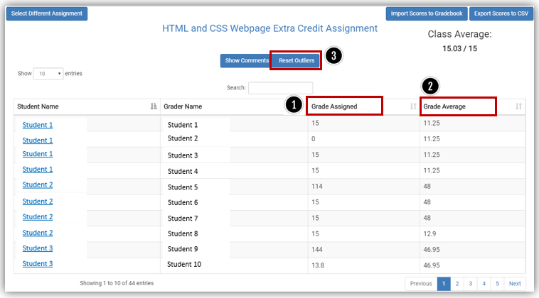

# Canvas Peer Grade Calculator

The Peer Review Tool makes grading a peer review assignment much easier. 
After your students have reviewed and graded their peers, you can use this tool to easily view individual grades and comments, calculate average scores, identify outliers, export grades to Excel and import average scores to the Canvas grade book.
This does not replace the Canvas peer review tool, it only enhances the grading portion.

## How to use

### Create a Peer Review assignment in Canvas with a rubric

Create a Peer Review assignment in Canvas and attach a rubric which students will use to grade their peers.
* [How do I use peer review assignments in a course?](https://community.canvaslms.com/t5/Instructor-Guide/How-do-I-use-peer-review-assignments-in-a-course/ta-p/697)
* [How do I create a peer review assignment?](https://community.canvaslms.com/t5/Instructor-Guide/How-do-I-create-a-peer-review-assignment/ta-p/641)
  * [How do I manually assign peer reviews for an assignment?](https://community.canvaslms.com/t5/Instructor-Guide/How-do-I-manually-assign-peer-reviews-for-an-assignment/ta-p/650)
  * [How do I automatically assign peer reviews for an assignment?](https://community.canvaslms.com/t5/Instructor-Guide/How-do-I-automatically-assign-peer-reviews-for-an-assignment/ta-p/899)
* [How do I view student peer review comments as an instructor?](https://community.canvaslms.com/t5/Instructor-Guide/How-do-I-view-student-peer-review-comments-as-an-instructor/ta-p/1088)

Wait for students to submit their assignments and grade each other using the rubric.

### Open the Calculator and choose the assignment.

Select the Assignment from drop-down menu [1] and click 'Begin Review' [2].

### View assignment details

On the Assignment details page, you can 'Select a Different Assignment' [1] or change the number of entries to display (10, 25, 50 or 100) for the current assignment [2]. In the upper right are buttons to 'Import Scores to the Gradebook' [3] and/or 'Export Scores to an Excel CSV' [4].

You can sort any column by clicking the heading [1] or 'Search' for a particular student by entering their name in the text box [2]. You can click on a student's name to view their assignment submission in SpeedGrader [3].

Click 'Show Comments' to see comments left by peer reviewers [1].

Comments will appear in the far right column [1]. Click 'View Comments' to view details [2]. You can hide comments by clicking the 'Hide Comments' button [3].

### Viewing grades and identifying outliers

Click the 'Identify Outliers' button to find grades outside a given point range [1]. Click 'Find Outliers' to see the results [2].

The table will display grades that meet the criteria selected. You can sort by Grade Assigned [1] or Grade Average [2]. You can also 'Reset Outliers' to try different point deviations [3].

